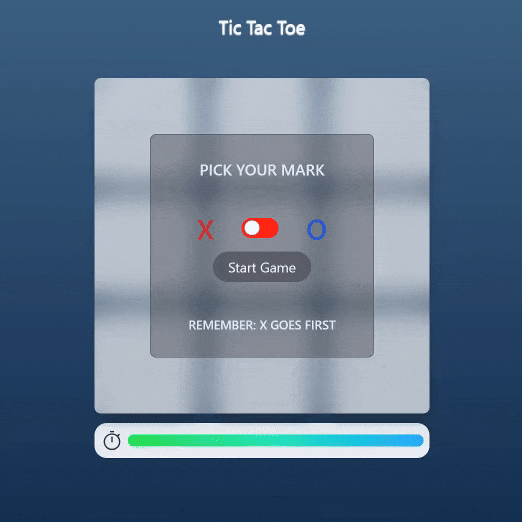

# Tic-Tac-Toe

A high-stakes version of the classic Tic-Tac-Toe game. It features a modern metallic UI, Player vs. Computer logic, and a unique "Time Pressure" mechanic that penalizes indecision.

## 🔗 Links

- **Live Demo Link:** https://e3prime.github.io/tic_tac_toe

## ⚔️ Tic Tac Toe Showcase

## 🧐 About The Project

A game classic of Tic Tac Toe! but with a twist. A background timer constantly ticks down during the player's turn. If the player hesitates too long, the game logic interrupts, allowing the Computer to take a turn immediately often placing the player in a losing position.

### Key Features

- **Time Pressure Mechanic:**
  - A visual progress bar depletes rapidly during the user's turn.
  - **Penalty:** If the timer reaches zero, the computer automatically takes a move, effectively skipping the player or forcing a random disadvantageous move.
- **Computer Opponent:** Includes logic for the Computer to block player wins or seize open opportunities.
- **Dynamic Side Selection:**
  - Users can toggle between playing as "X" (goes first) or "O" (goes second) using a custom animated switch.
- **Modern Aesthetic:**
  - Features a brushed metal background and glassmorphism overlays utilizing Tailwind CSS.
